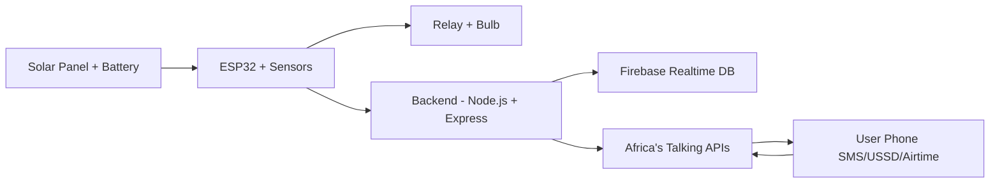

# ⚡ SolarPay – Smart IoT Solar Pay-As-You-Go System
🌞 **Powering Africa with IoT + Pay-As-You-Go Solar**  
Built at the **Africa's Talking Women in Tech Hackathon 2025** ✨  
  
  
  
---
## 🌍 Problem
Millions of households in Africa use small solar systems but:  
- ⚠️ Don't know when their battery will die (sudden blackouts).  
- 💸 Struggle with flexible, affordable payment methods.  
- 📵 Lack access to internet — only feature phones available.  
---
## 💡 Our Solution: **SolarPay**
✅ IoT-powered battery monitoring  
✅ Affordable **Pay-As-You-Go energy** with Airtime  
✅ **USSD & SMS access** (works even on Kabambe phones)  
✅ Visual hardware demo: light bulb ON/OFF after payment  
---
## ✨ Features
- 🔋 **Battery Monitoring** → ESP32 + sensors track solar battery status.  
- 📱 **USSD/SMS Menu** → Users dial `*123#` to check power status.  
- 💰 **Pay-As-You-Go with Airtime API** → Unlock power for small payments.  
- 💡 **Relay-Controlled Demo Load** → Light bulb switches ON/OFF after recharge.  
- ☎️ **Optional Voice Alerts** → For accessibility.  
---
## 🛠️ Tech Stack
**Hardware** ⚡  
- ESP32 microcontroller  
- Voltage Sensor + Current Sensor  
- Relay Module + Light Bulb  
**Backend** 🖥️  
- Node.js + Express  
**Database** 🗄️  
- Firebase Realtime Database  
**Africa's Talking APIs** 📡  
- SMS API → Battery alerts  
- USSD API → Interactive menu  
- Airtime API → Pay-As-You-Go payments  
- Voice API → Optional status calls  
---
## 🏗️ System Architecture


---
## 🚀 Getting Started

### 📋 Prerequisites
- **Node.js** (v16 or higher)
- **Arduino IDE** (for ESP32 programming)
- **Africa's Talking Account** with API keys
- **Firebase Project** set up
- **Hardware Components:**
  - ESP32 Development Board
  - Voltage/Current Sensors
  - Relay Module
  - Light Bulb (for demo)
  - Breadboard & Jumper Wires
  - Solar Panel + Battery (12V recommended)

### ⚙️ Hardware Setup
1. **Wire the ESP32:**
   ```
   ESP32 Pin    →    Component
   A0          →    Voltage Sensor
   A1          →    Current Sensor  
   GPIO2       →    Relay Module
   3.3V        →    Sensor VCC
   GND         →    Common Ground
   ```

2. **Connect Relay to Load:**
   - Relay input: GPIO2 (ESP32)
   - Relay output: Light bulb circuit

### 🔧 Software Installation

#### 1. Clone the Repository
```bash
git clone https://github.com/Cheptoo-dev/Africa's-Talking-Solarpay-Hackathon
cd solarpay-hackathon
```

#### 2. Backend Setup
```bash
# Install dependencies
npm install

# Create environment file
cp .env.example .env

# Configure your .env file:
AT_API_KEY=your_africas_talking_api_key
AT_USERNAME=your_africas_talking_username
FIREBASE_CONFIG=your_firebase_config
PORT=3000
```

#### 3. Firebase Configuration
```bash
# Install Firebase CLI
npm install -g firebase-tools

# Login and initialize
firebase login
firebase init
```

#### 4. ESP32 Firmware
1. Open `firmware/solarpay_esp32/solarpay_esp32.ino` in Arduino IDE
2. Install required libraries:
   - WiFi
   - HTTPClient
   - ArduinoJson
3. Update WiFi credentials and server URL
4. Upload to ESP32

### 🏃‍♀️ Running the Application

#### Start the Backend Server
```bash
npm start
# Server runs on http://localhost:3000
```

#### Test USSD Integration
```bash
# Test USSD webhook
curl -X POST http://localhost:3000/ussd \
  -H "Content-Type: application/x-www-form-urlencoded" \
  -d "sessionId=123&serviceCode=*123#&phoneNumber=+254700000000"
```

#### Hardware Testing
1. Power on ESP32 with sensors connected
2. Check serial monitor for sensor readings
3. Verify data appears in Firebase console
4. Test relay activation via web interface

### 📱 Testing the Complete Flow
1. **Power Check:** Dial `*123#` to check battery status
2. **Low Battery:** Receive SMS alert when battery < 20%
3. **Payment:** Use airtime to purchase power credits
4. **Activation:** Relay turns ON, powering the light bulb

### 🐛 Troubleshooting
- **ESP32 won't connect:** Check WiFi credentials and signal strength
- **No sensor data:** Verify wiring and sensor power supply
- **USSD not working:** Confirm Africa's Talking webhook URL is publicly accessible
- **Firebase errors:** Check service account permissions and database rules

---
## 📸 Demo
[Add screenshots or video links here]

---
## 👥 Team
Built with ❤️ at Africa's Talking Women in Tech Hackathon 2025

---
## 📄 License
MIT License - see LICENSE file for detailsMIT License - see LICENSE file for details
